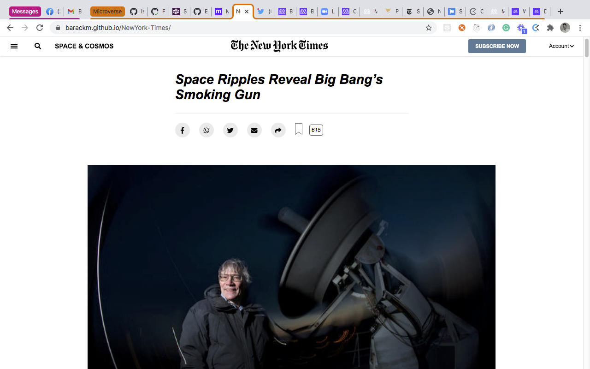

# NewYork-Times

> This is the NewYork Time acrticle page clone.

## Built With

- HTML
- CSS

## Live Demo

[Live Demo Link](https://barackm.github.io/NewYork-Times/)

## Getting Started

No prerequisites
To get a local copy up and running:

1. Clone the repo or download the Zip folder
2. Run live server or simply open the index.html file with a browser

## Author

👤 **Barack**

- GitHub: [@barackm](https://github.com/barackm)
- Twitter: [@BarackMukelenga](https://twitter.com/BarackMukelenga)
- LinkedIn: [baraka-mukelenga](https://www.linkedin.com/in/baraka-mukelenga/)

Contributions, issues, and feature requests are welcome!

## Show your support

Give a ⭐️ if you like this project!

## 📝 License

This project is [MIT](lic.url) licensed.
